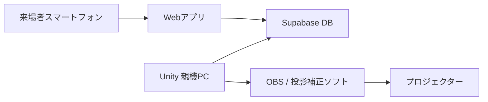

# 海のプロジェクションマッピング 仕様書

## 1. プロジェクト概要

学校授業「創造工学」における、来場者参加型のプロジェクションマッピング作品を制作する。

来場者はスマートフォンでQRコードを読み取り、Webアプリ上で魚を選択・カスタマイズして「放流」する。放流された魚の情報はデータベースに保存され、親機PC上のUnityアプリが定期的に取得する。Unity内の海中シーンに魚がスポーンし、プロジェクターで壁面と天井の一部へ投影される。

作品の主目的は、来場者が自分の作った魚が大きな海の中に現れる体験を楽しめることとする。技術的な厳密性よりも、体験のわかりやすさ、見た目の楽しさ、発表時の安定性を優先する。

| 項目 | 内容 |
| --- | --- |
| 作品テーマ | 来場者が魚を放流できる海中空間 |
| 発表時期 | 7月後半予定 |
| 想定人数 | 同時接続20人未満、最大50人程度 |
| 表示環境 | Windows PC + Unity + OBS/投影補正ソフト + HDMI接続プロジェクター |
| 投影面 | 壁1面 + 天井の一部 |
| Webアプリ | スマートフォン向け日本語UI |
| データ保存 | Supabase |
| リポジトリ | UnityプロジェクトとWebアプリを同一GitHubリポジトリで管理 |

## 2. 体験フロー

### 2.1 来場者フロー

1. 会場に掲示されたQRコードをスマートフォンで読み取る。
2. Webアプリを開く。
3. ニックネームを入力する。
4. 魚の種類を選ぶ。
5. 色や模様などをカスタマイズする。
6. プレビューを確認する。
7. 「放流」ボタンを押す。
8. 数秒から10秒程度で、投影中の海に自分の魚が現れる。

### 2.2 親機PCフロー

1. Unityアプリを起動する。
2. UnityがSupabase/APIへ定期的にアクセスする。
3. 新しく登録された魚データを取得する。
4. 魚データに応じてUnity内に魚をスポーンする。
5. OBSまたは投影補正ソフト経由でプロジェクターに出力する。

## 3. システム構成



### 3.1 推奨技術

| 領域 | 技術 |
| --- | --- |
| Webフロントエンド | Next.js / React |
| UI | スマートフォン向け日本語UI |
| DB/API | Supabase |
| 3D表示 | Unity 6.4 |
| 開発PC | Windows / RTX 3060 |
| バージョン管理 | Git / GitHub |
| デプロイ | VercelまたはRender |
| 投影 | OBS + 投影補正ソフト |

## 4. 機能要件

### 4.1 Webアプリ

| 機能 | 内容 | 優先度 |
| --- | --- | --- |
| QRコードアクセス | 固定URLにアクセスしてWebアプリを開く | Must |
| ニックネーム入力 | 1から12文字程度の名前を入力する | Must |
| 不適切表現対策 | 禁止ワード、URL、改行、記号だらけの入力を弾く | Must |
| 魚種選択 | クマノミ、クラゲ、マグロ、オリジナル魚などから選ぶ | Must |
| 色変更 | メインカラー、サブカラーを選ぶ | Must |
| 模様選択 | なし、しましま、まだらなどを選ぶ | Should |
| サイズ選択 | 小、中、大から選ぶ | Should |
| 性格選択 | のんびり、すばやい、群れ好きなどを選ぶ | Should |
| プレビュー | 2Dまたは軽量3Dで見た目を確認する | Should |
| 放流 | 入力内容をSupabaseに登録する | Must |
| 完了画面 | 放流完了を表示する | Must |

### 4.2 Unity

| 機能 | 内容 | 優先度 |
| --- | --- | --- |
| 海中シーン表示 | 海底、装飾、魚、泡、光を含む海中空間を表示する | Must |
| 魚データ取得 | Supabase/APIから新規魚データを5から10秒ごとに取得する | Must |
| 魚スポーン | 取得データをもとに魚を生成する | Must |
| 魚のカスタマイズ反映 | 魚種、色、模様、サイズ、性格を反映する | Must |
| 泳ぎ行動 | 魚が海中を自然に泳ぐ | Must |
| 群れ行動 | 魚種や性格に応じてそれっぽく群れる | Should |
| 種類別行動 | クラゲは上下移動、マグロは回遊などの個性を持たせる | Should |
| ニックネーム表示 | カメラが魚に近づいたときだけ表示する | Should |
| 魚の削除 | 一定時間経過または最大数超過で古い魚を削除する | Must |
| カメラワーク | 水中をゆっくり泳ぐような滑らかな観察カメラ | Must |

### 4.3 投影

| 機能 | 内容 | 優先度 |
| --- | --- | --- |
| 全画面出力 | Unity画面をフルスクリーン出力する | Must |
| OBS取り込み | Unity画面をOBSで取り込む | Should |
| 空間補正 | 投影面に合わせて映像を歪ませる | Must |
| 壁面中心設計 | 魚とニックネームは主に壁面に表示する | Must |
| 天井演出 | 天井側は水面、光、泡、背景演出を中心に使う | Should |

## 5. データ設計

### 5.1 fishesテーブル案

| カラム | 型 | 内容 |
| --- | --- | --- |
| id | uuid | 魚ID |
| nickname | text | 表示名 |
| species | text | 魚種 |
| main_color | text | メインカラーのHEX値 |
| sub_color | text | サブカラーのHEX値 |
| pattern | text | 模様タイプ |
| size | text | サイズ |
| personality | text | 性格 |
| created_at | timestamp | 放流日時 |
| spawned | boolean | Unity側で取得済みかどうか |

### 5.2 登録データ例

```json
{
  "nickname": "うみたろう",
  "species": "clownfish",
  "main_color": "#ff7a1a",
  "sub_color": "#ffffff",
  "pattern": "stripe",
  "size": "medium",
  "personality": "schooling"
}
```

## 6. 魚モデル制作ルール

班員がBlenderで制作するモデルは、Unityで扱いやすいことを優先する。

- 形式はFBXまたはglTF/GLBを基本とする。
- 魚の向き、原点、スケールをなるべく統一する。
- まずは低ポリゴンで軽量なモデルを優先する。
- 色をUnity側で変更しやすいよう、マテリアルは単純にする。
- 尾びれや体の揺れなど、最低限の泳ぎアニメーションを用意する。
- アクセサリを作る場合は、魚本体と別オブジェクトにする。
- 海底、岩、サンゴ、泡などの装飾も軽量化を意識する。

## 7. 投影補正方針

投影面は壁1面と天井の一部を想定する。壁と天井の境目は歪みが目立ちやすいため、作品上の主役である魚やニックネームは壁面側を中心に表示する。

天井側は、水面のゆらぎ、光の筋、泡、遠景の水中表現など、多少歪んでも違和感が出にくい映像を割り当てる。

### 7.1 補正手順

1. 投影面の寸法を測る。
2. プロジェクターの位置を固定する。
3. Unityで補正用テスト画像を表示する。
4. 投影補正ソフトで壁面の四隅を合わせる。
5. 天井側を別面として追加し、境目が自然に見えるよう調整する。
6. 魚、文字、重要な演出が境目にかかりすぎないようUnity側のカメラ構図を調整する。
7. 本番前に明るさ、ピント、壁と天井の歪みを確認する。

## 8. 非機能要件

| 項目 | 要件 |
| --- | --- |
| 同時接続 | 最大50人程度を想定 |
| Unity取得間隔 | 5から10秒程度 |
| 反映時間 | 放流後10秒程度を目標 |
| 最大魚数 | 80から150匹程度 |
| 魚の表示時間 | 5から15分程度 |
| 最低魚数 | 一定数以下の場合は古い魚を消さない |
| フレームレート | 投影時30fps以上を目標 |
| 安定性 | 発表時は機能数より動作安定性を優先 |

## 9. MVP範囲

最初に完成させる範囲を以下とする。

- スマートフォンでWebアプリを開ける。
- ニックネームを入力できる。
- 魚種を選べる。
- 色を選べる。
- 放流ボタンでSupabaseに登録できる。
- Unityが新規魚データを取得できる。
- Unity内に魚がスポーンする。
- 魚が泳ぐ。
- 一定時間または最大数超過で魚が削除される。
- Unity画面をプロジェクターに投影できる。

## 10. 余裕があれば追加する機能

- 3Dプレビュー
- アクセサリ選択
- 放流時の演出
- 魚ごとの詳細な行動差
- Webアプリのアニメーション強化
- 管理画面
- 投影用の複数画面出力

## 11. スケジュール案

| 期間 | 作業 |
| --- | --- |
| 1週目 | 仕様確定、Supabase準備、仮モデルでUnity海シーン作成 |
| 2週目 | WebアプリMVP、DB登録、Unity側の魚スポーン |
| 3週目 | Unityの泳ぎ行動、魚削除、ニックネーム表示 |
| 4週目 | Blenderモデル差し替え、見た目調整、投影テスト |
| 5週目 | 不具合修正、発表用QRコード、最終リハーサル |

## 12. リスクと対策

| リスク | 対策 |
| --- | --- |
| 3Dプレビューが重い | 最初は2Dプレビューで実装する |
| DB/API連携で詰まる | Supabaseを使い、自前サーバーを最小限にする |
| 魚が増えすぎて重い | 最大魚数と表示時間を設定する |
| 投影面の歪みが目立つ | 魚と文字を壁面中心にし、天井は背景演出にする |
| ニックネームに不適切表現が入る | Web側とUnity側の両方でフィルタする |
| 本番ネットワークが不安定 | 早めに実環境で接続テストを行う |
| Blenderモデルの納期が遅れる | 仮モデルで先に実装し、後から差し替える |

## 13. 開発方針

同一リポジトリ内で、WebアプリとUnityプロジェクトを分けて管理する。

```text
repository-root/
  web/
    Next.js app
  unity/
    Unity project
  docs/
    設計資料、投影メモ
  spec.md
```

最初は仮モデル・仮データで実装を進め、Webから登録した魚がUnityに出るところを最優先で完成させる。その後、見た目、魚種ごとの個性、投影調整を順番に強化する。
